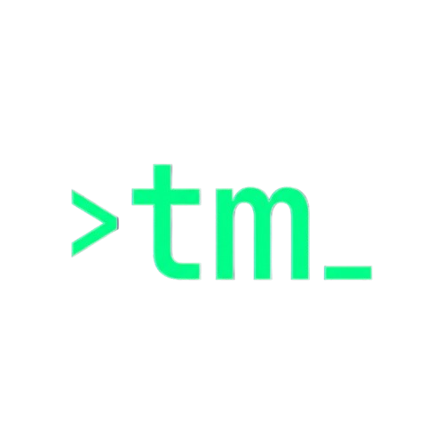

<p align="center">
  
</p>

A minimal interactive tmux session manager for the terminal. Replaces the need to remember tmux session commands with a keyboard-driven menu built on [gum](https://github.com/charmbracelet/gum).


## Features

- **Interactive Session Management**: Keyboard-driven menu for easy session navigation
- **Smart Session Handling**: Automatically attaches to existing sessions or creates new ones
- **Context-Aware**: Works both inside and outside tmux sessions
- **Quick Actions**: Rename, close, or create sessions with single keystrokes
- **Bulk Operations**: Kill all sessions with a single command
- **Visual Feedback**: Color-coded terminal output using gum styling

## Requirements

| Dependency | Purpose |
|-----------|---------|
| `tmux` | Terminal multiplexer |
| `gum` | Interactive CLI tool ([install](https://github.com/charmbracelet/gum#installation)) |

## Installation

```bash
chmod +x tmm
./tmm --install
```

The installer will:
- Copy the script to `/usr/local/bin/tm`
- Add an alias (`alias tm="/usr/local/bin/tm"`) to your `.bashrc`, `.zshrc`, or `~/.config/fish/config.fish`

Reload your shell after installing:

```bash
source ~/.bashrc   # or source ~/.zshrc
```

## Usage

```
tm                 Interactive session manager
tm <session-name>  Attach to a named session, or create it if it doesn't exist
tm close           Kill all sessions (with confirmation prompt)
tm --install       Install to /usr/local/bin and add shell alias
tm --uninstall     Remove from /usr/local/bin and shell alias
tm --version       Show version number
tm --help          Show usage
```

## Interactive Menu

Running `tm` with no arguments opens a session list. Navigate with arrow keys and press Enter to select a session, then choose an action:

| Key | Action |
|-----|--------|
| `o` | Open / attach to session |
| `c` | Close session (with confirmation) |
| `r` | Rename session |
| `n` | Create a new named session |
| `q` | Quit |

If no sessions exist, you will be prompted to create one.

## How It Works

<details>
<summary>Technical Details</summary>

The script intelligently handles tmux context:

- **Outside tmux**: Uses `tmux attach-session` to attach to sessions
- **Inside tmux**: Uses `tmux switch-client` to avoid nesting issues
- **Session detection**: Queries `tmux ls` to enumerate active sessions
- **Installation**: Auto-detects your shell (bash/zsh/fish) and adds appropriate aliases

The `tm close` command calls `tmux kill-server`, which terminates all sessions and the server process.
</details>

## Uninstall

```bash
./tmm --uninstall
```

Or manually:

```bash
sudo rm /usr/local/bin/tm

# Remove the alias from your shell config
# Edit ~/.bashrc, ~/.zshrc, or ~/.config/fish/config.fish
# and remove the line: alias tm="/usr/local/bin/tm"
```

## Changelog

See [CHANGELOG.md](CHANGELOG.md) for version history and release notes.

## License

MIT License - feel free to use and modify as needed.
